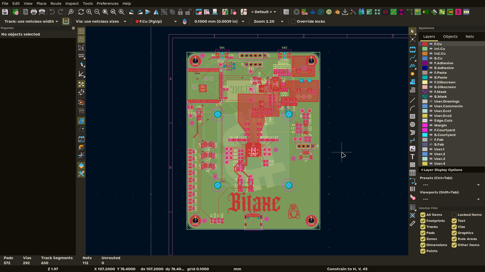

# February 14

Started the BitcoinMiner project. I wanted a single-board miner with everything on one PCB:
- Asic
- Wifi
- Fan
- Power

Picked the BM1370 over the BM1368 for the better efficiency and because secondary market pricing has come down.

Split the schematic into hierarchical subsheets (BM1370, Power, ESP32, Fan) and imported the footprints and symbols from the bitaxe gamma library since KiCad had nothing for the ASIC.

**Total Time Spent: 5 hours**

# February 15

Added the Ethernet and fan subsheets, then started the first PCB pass. Used three level translators to step the 1.2V ASIC signals up to the ESP32's 3.3V. Ethernet would end up being removed later, even though i put a lot of effort into it.

**Total Time Spent: 7 hours**

# February 16

Grinded on routing the Ethernet PHY and the power section. The inductor placement kept ending up too far from the output caps..

Routed the 1.2V rail as a solid copper pour across two layers to keep voltage drop in check for the 15A the ASIC draws at full hash rate.

**Total Time Spent: 6 hours**

# February 17

Eight hours finishing the first routing pass.
Placed the fan controller close to the ASIC so the remote temperature diode traces stay short.
The decoupling caps around the BM1370 took the longest because there are so many

Added mounting holes and fiducials for pick-and-place. The board was fully connected by the end, with 30 DRC issues.

**Total Time Spent: 8 hours**

# February 20

Fixed all 30 DRC violations.
Most were at the USB-C connector where the pads are very tight.
cut a relief in the ground pour around it to give the data traces room.
The barrel jack had the wrong footprint, switched it to a different outline. 
Caught two traces on the wrong layer that would have shorted to the power plane.

**Total Time Spent: 4 hours**

# February 22

Reworked the power section.
Moved the inductor 2mm closer to the output caps, widened the pour and added ground vias under it
parasitic inductance dropped from 1nH to ~0.5nH and simulated ripple from 40mV to 18mV.
Bumped the bulk caps up to 100uF.

Added the bitcoin logo to the silkscreen.

**Total Time Spent: 3 hours**

# March 8-9

Re-ran DRC after a few weeks away and stitched up some ground pour that had fragmented during the power rework.
Reorganized the repo:
- KiCad files moved into `kicad/`
- 3D STEP files into `kicad/3d/`
- accumulated KiCad backup zips got deleted.

**Total Time Spent: 6 hours**

# August 12

Finished the schematic after a long break.
Connected the remaining ESP32 GPIO breakout headers
set proper USB CC resistor values
ran ERC across all the sheets
Added a .gitignore
Found a duplicate C58 reference and standardized the net labels to match the bitaxe naming conventions.
Started the readme.

**Total Time Spent: 4 hours**

# August 13

Finished the readme and added the WS2812B status LED chain. First time using `kicad-cli pcb render` instead of Blender, it ray-traces all the board angles in about 30 seconds each.

**Total Time Spent: 5 hours**

# August 16

Removed Ethernet.
ethernet stuff ate 15% of the board for a feature WiFi already covers
also it was my first time using Ethernet in a project.
Dropped the subsheet, cleaned up the dangling nets.
rerouted the power section with the freed-up space. 
The schematic has four subsheets instead of five.

maybe i'l make an ethernet project soon?

**Total Time Spent: 3 hours**

# September 5

Decided to finish the board before school.
Annotated the entire schematic, routed the PCB better to handle the high currents the ASIC needs, and beefed up all the power rails.
Added logos and a few easter eggs hidden in the board. Board is 100x75mm, 4-layer FR4.

# September 16

Put together the order - filled in LCSC part numbers and links for every line item in the BOM. Built the firmware: vendored bitaxe's ESP-Miner into `firmware/` and added a "bitcoinMiner" board target (ESP32-S3, BM1370, 525MHz) with its own config CSV. Flashing and pin docs live in `firmware/README.md`.

**Total Time spent: 3 hours**