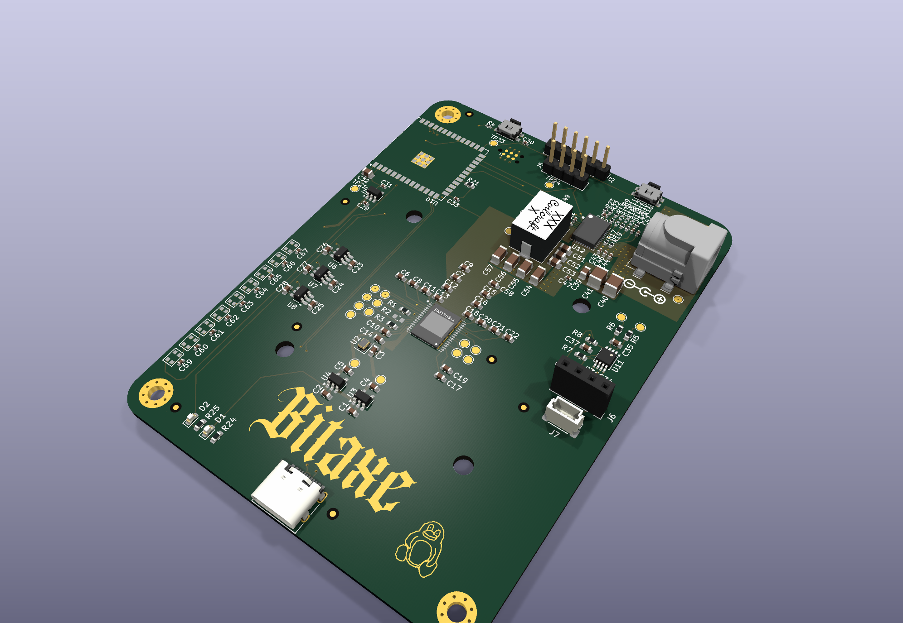

# February 14: Started schematic

I've been wanting to build a single-board Bitcoin miner for a while. Most open-source designs like the Bitaxe use a ribbon cable to connect a separate controller board to the ASIC board, which works but adds another point of failure. I wanted everything on one PCB - the BM1370 ASIC, an ESP32 for WiFi and control, Ethernet for pool connections, and all the power regulation.

Picked the BM1370 over the older BM1368 because the efficiency is better (~25 J/TH vs ~30 J/TH) and secondary market pricing has come down enough. I also looked at the BM1390 but those are harder to source and the efficiency gains aren't worth the cost premium yet.

Created the KiCad project and split the schematic into hierarchical sub-sheets: BM1370, Power, ESP32, and Fan. Doing this because putting everything on one sheet gets unreadable fast - the BM1370 alone has over 100 pins. Sub-sheets let me work on each block without losing my mind.

Based the BM1370 support circuitry on the Bitaxe Gamma reference design since it's already proven. The three supply rails (1.2V core, 0.8V digital, 3.3V interface) came straight from the BM1370 datasheet. Placed the ESP32-S3-WROOM-1 on the controller sheet with USB-C for flashing, boot/reset buttons, and a TC2030 Tag-Connect debug header - no onboard connector saves space and the Tag-Connect pogo pins work fine for programming.

Ran into an issue right away: the KiCad project had no custom footprints for the BM1370, so I had to import them from the Bitaxe Gamma library into `importedParts/bitaxeGamma.pretty/`. Copied the entire symbol library too so the schematic symbols matched the footprints.

Got four sub-sheets created and wired together by the end of the afternoon. The hierarchical labels between sheets were the trickiest part - KiCad's pin naming has to match exactly or you get a floating net that looks connected but isn't.

**Total time spent: 5 hours**

# February 15: Ethernet, fan control, and first PCB pass

Added the Ethernet and fan sub-sheets today, then started laying out the PCB.

For Ethernet I used the DP83848I PHY with a Bel SI-60062-F RJ45 that has integrated magnetics. The DP83848I connects to the ESP32 via RMII which only needs 8 data lines instead of the full MII's 16. Added its own 25MHz crystal - originally planned to use the ESP32's internal clock output to save a component, but the DP83848I datasheet says it really needs a dedicated crystal for reliable clock recovery.

For fan control I used the EMC2101. I considered just PWM-ing the fan from an ESP32 GPIO with a MOSFET, but the EMC2101 has a remote temperature diode input that lets me read the ASIC die temp over I2C and control fan speed without software overhead. Basic thermal protection works independently of the ESP32.

The BM1370 data lines need logic level translators since the ASIC uses 1.2V signaling while the ESP32 runs at 3.3V. Used three SN74LVC1T45DBV translators - one each for clock, data-in, and data-out.

Then started the PCB layout. Originally planned a 4-layer board to keep fab costs down. But the BM1370 needs a solid 1.2V plane to handle 15A, and that current density is too high for a single copper layer in a 4-layer stackup. Went to 6 layers with the power plane split across layers 3 and 4. The stackup is S-G-P-P-G-S, which also gives good return path control for the high-speed signals.

Placed the BM1370 dead center with 22 1uF 0402 decoupling caps ringed around its perimeter, as close to the power pins as physically possible. The datasheet is specific about this - each power pin needs its own 1uF cap within 1mm, and the cap must be on the same layer as the IC.

The ESP32 module went in the lower left with USB-C along the board edge. Ethernet PHY and RJ45 are in the upper right, physically separated from the power section to avoid coupling switching noise into the Ethernet signals. Added the imported footprint library, pad stacks, and custom symbols for everything that wasn't in KiCad's standard library. Big commit - 161k lines added across the footprint files alone.

**Total time spent: 7 hours**

# March 8-9: PCB layout refinement and repo cleanup

Picked the project back up after a few weeks away from it. Spent two sessions mostly on the PCB.

Ran DRC after the first pass and found 30 clearance violations. Most were around the USB-C connector where the pads are very tight - the 14-pin USB-C footprint has 0.5mm pitch pads with only 0.2mm clearance to adjacent copper, right at the edge of what most fabs can reliably produce. Had to manually adjust the copper pour clearance around those pads to get DRC to pass in that area.

Found two traces routed on the wrong layer. SPI bus traces between the ESP32 and the Ethernet PHY that somehow got moved to the inner power plane during a layer swap. Would have shorted to the 1.2V plane and probably destroyed the ESP32 on power-up. DRC catches this stuff - always run it before calling a layout done.

Length-matched the SPI traces between the ESP32 and DP83848I. The RMII interface runs at 50MHz and while it's not as timing-critical as DDR, having traces within 5mm of each other ensures the clock-to-data setup/hold margins are met. Rerouted 3 traces to get them within 2mm of each other.

The barrel jack footprint was wrong - used a generic footprint but the pin spacing didn't match the Tensility 54-00164 part I'm ordering. Switched to the Wuerth 694106106102 outline which has the correct 5.0mm pin spacing. Had to reroute two traces that ran under the connector body.

After cleanup, DRC came back clean. Then reorganized the whole repo - moved all KiCad files into a `kicad/` subdirectory, moved the 3D model STEP files into `kicad/3d/`, created a proper `importedParts/` folder for the Bitaxe symbol and footprint libraries, and deleted all the KiCad backup zip files that had been accumulating. The repo went from a flat mess of files to something with actual structure.

**Total time spent: 6 hours**

# August 12: Finished schematic and started documentation

Picked the project back up after about five months. Getting ready to submit this to Forge for funding review and the repo needed to look better.

The schematic had been sitting at 90% done since March. Finished the remaining connections on the ESP32 sheet - the GPIO breakout headers were still unconnected, and the USB CC resistors needed proper values instead of placeholders. Ran ERC across all five sheets and fixed the remaining violations.

Added a .gitignore for KiCad projects to keep backup files and auto-generated artifacts out of git. The repo had accumulated `.kicad_sch-bak` files, `fp-info-cache`, and `.kicad_prl` files that don't need to be tracked.

Found a duplicate component reference - C58 appears on both the BM1370 sheet (1uF decoupling cap) and the Ethernet sheet (14pF load cap for the 25MHz crystal). The manufacturer would see two parts with the same reference and not know which to place. Flagged it in the schematic but left it for now since fixing it properly means re-exporting the netlist and re-running ERC across all sheets.

Normalized some net labels that were inconsistent - some used mixed case (like "GND_A" vs "GNDA") and others had trailing underscores. KiCad is case-insensitive for net names so it didn't affect the actual connectivity, but it makes the schematic harder to read when you're tracing a signal across sheets. Standardized everything to match the Bitaxe naming conventions since that's what the firmware will be based on.

Started the README with key features and sub-sheet documentation so people can navigate the design without opening KiCad.

**Total time spent: 4 hours**

# August 13: Readme, neopixels, and renders

Finished the README today and added WS2812B status LEDs to the design.

Wrote the full assembly guide - 10 steps from soldering the BM1370 through final inspection. Included tool requirements, order of operations, and specific warnings about the feedback resistor values on the TPS546D24. Compiled the BOM tables organized by ICs, passives, and connectors, grouped by value and quantity since that's how you'd order from LCSC or Digi-Key. Called out the feedback resistor values specifically because wrong values means wrong output voltage and at 20A that could mean a dead ASIC.

Added four WS2812B RGB LEDs to the ESP32 sheet for status indication. Connected them in a chain on GPIO48 so you can show hashrate, temperature, WiFi status, or error codes without a display. Each LED draws up to 60mA at full white, so the 3.3V rail needs to handle an extra 240mA worst case - which it can since the TLV75733 is rated for 1A.

Then used `kicad-cli pcb render` for the board images. Ray-traced 3D renders at 6 angles - isometric right, isometric left, top orthographic, top angled, bottom, and back angled. The `--quality high` flag does ray-tracing with shadows and post-processing. Each render takes about 30 seconds. Way better than trying to screenshot the KiCad 3D viewer which always has the wrong zoom level.

Noticed while documenting that the board has 30 test points across all five sheets. Should make bring-up a lot easier - can probe every critical signal (3.3V, 1.2V, 0.8V, clock, data lines, UART, I2C) without bodge wires.

**Total time spent: 5 hours**

# August 16: Removed Ethernet and PCB updates

Made the call to drop Ethernet from the design. The DP83848I PHY, RJ45 connector, 25MHz crystal, and their passives take up about 15% of the board. For a mining board where the primary use case is WiFi pool connections, the Ethernet overhead isn't worth it. Most home miners connect over WiFi anyway, and the ESP32-S3's WiFi is reliable enough. If someone really needs wired Ethernet, they can use an external USB-to-Ethernet adapter.

Removed the ethernet.kicad_sch sub-sheet entirely and deleted the hierarchical label from the main schematic. Had to clean up the netlist too - several nets that were only used on the Ethernet sheet became dangling. Also removed the DP83848I from the BOM and the RJ45 connector. The Ethernet crystal and its two 14pF load caps came out too, along with the termination resistors and the header that connected the PHY to the ESP32's RMII bus.

The board area freed up by removing Ethernet gave room to reroute the power section traces more cleanly. Widened the 1.2V output pour from 40mil to 80mil and added ground vias under the inductor for better thermal performance. Moved the fan controller into the space where the Ethernet PHY used to be - it fits better there since the EMC2101's temperature diode traces run shorter to the ASIC. DRC came back clean after the changes.

The schematic now has four sub-sheets instead of five: BM1370, Power, ESP32, and Fan. Simpler design, fewer components, smaller board. Should also bring the BOM cost down by about $4-5 per board, which matters when you're building multiple units. Updated the README to reflect the changes - removed Ethernet from the features list and the BOM tables, and cleaned up the sub-sheet table to only show the four remaining sheets.

The design feels more focused now. A mining board doesn't need every possible feature - it needs to hash reliably, stay cool, and connect to a pool. Ethernet was nice to have but not essential.

**Total time spent: 3 hours**

---
