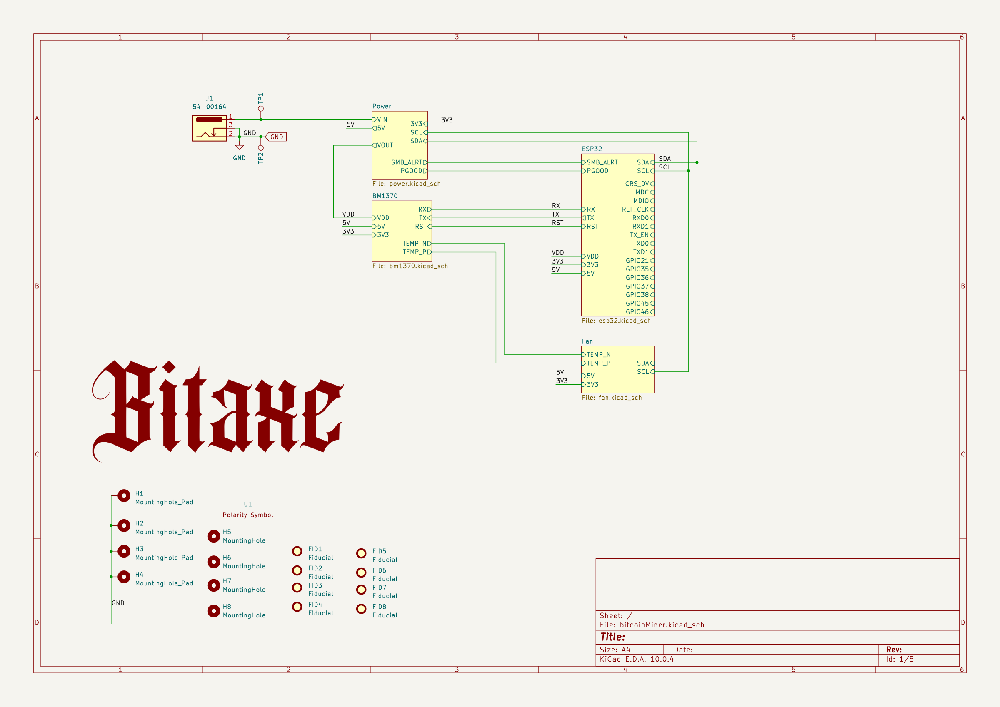
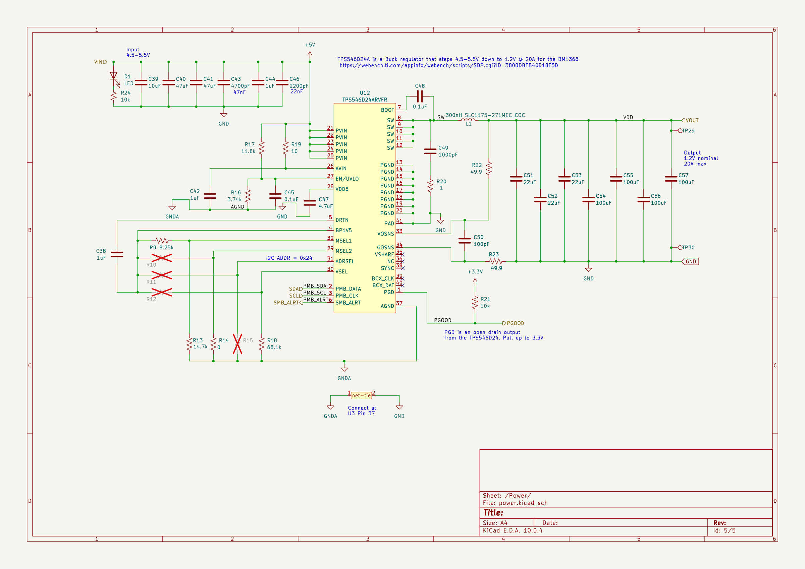
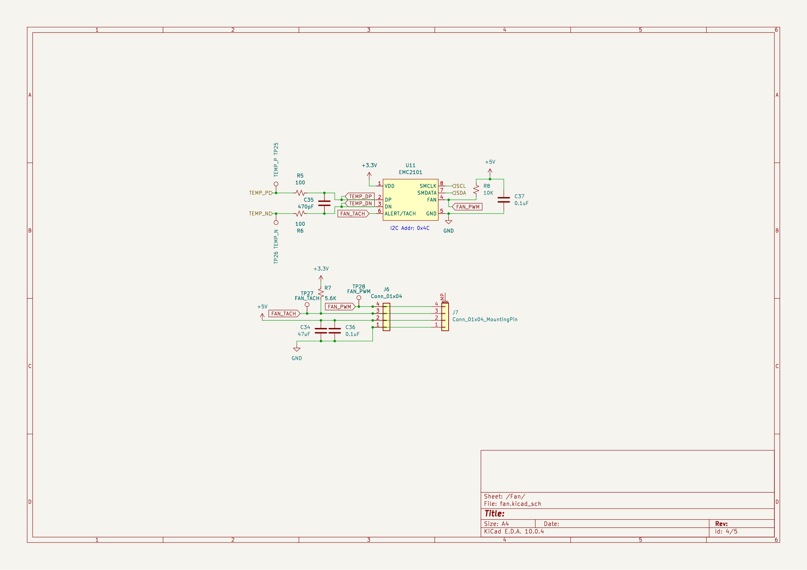
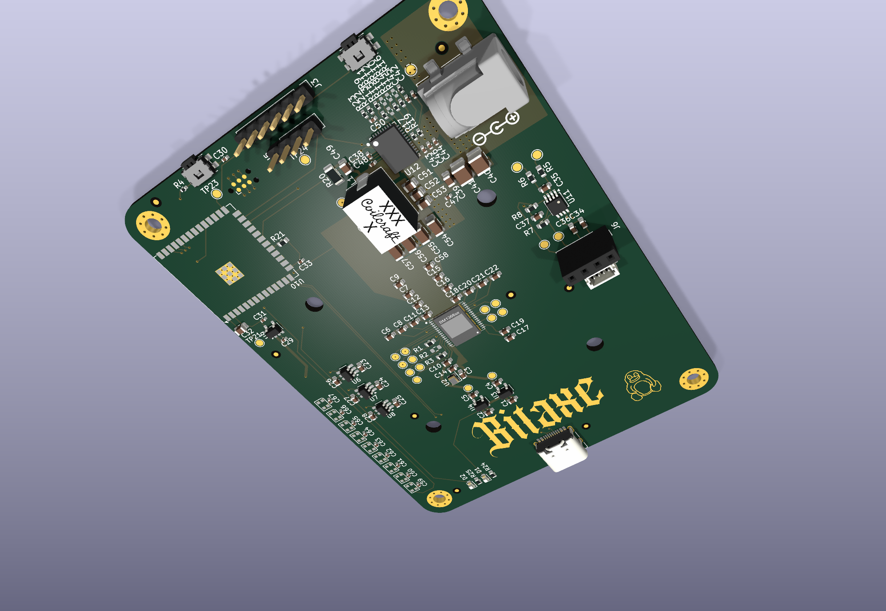
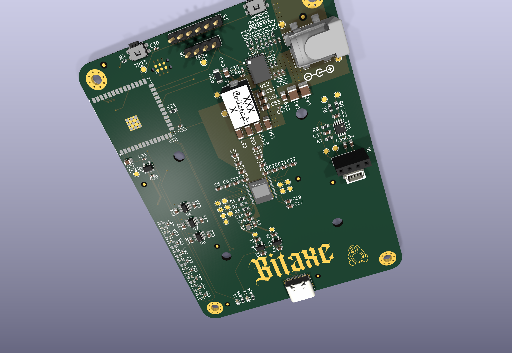
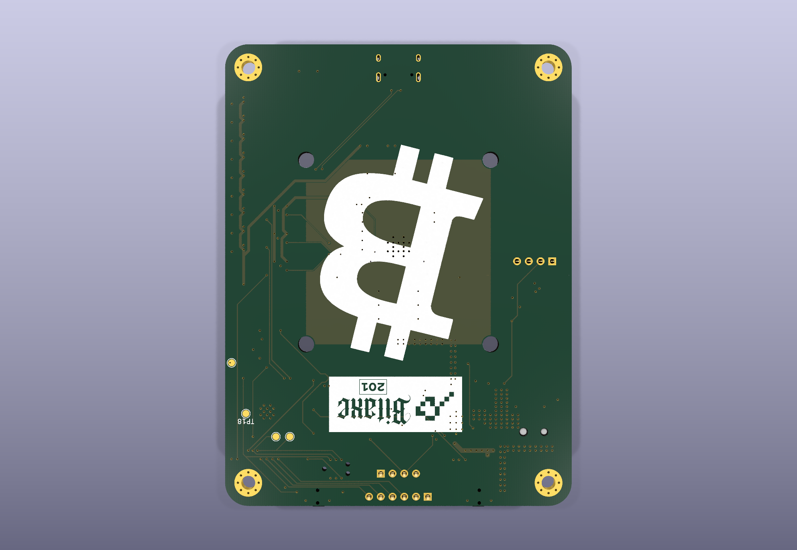

# February 14: Started schematic

I've been wanting to build a single-board Bitcoin miner for a while. Most open-source designs like the Bitaxe use a ribbon cable to connect a separate controller board to the ASIC board, which works but adds another point of failure. I wanted everything on one PCB - the BM1370 ASIC, an ESP32 for WiFi and control, Ethernet for pool connections, and all the power regulation.

Picked the BM1370 over the older BM1368 because the efficiency is better (~25 J/TH vs ~30 J/TH) and secondary market pricing has come down enough. I also looked at the BM1390 but those are harder to source and the efficiency gains aren't worth the cost premium yet.

Created the KiCad project and split the schematic into five hierarchical sub-sheets: BM1370, Power, ESP32, Ethernet, and Fan. Doing this because putting everything on one sheet gets unreadable fast - the BM1370 alone has over 100 pins. Sub-sheets let me work on each block without losing my mind.

Based the BM1370 support circuitry on the Bitaxe Gamma reference design since it's already proven. The three supply rails (1.2V core, 0.8V digital, 3.3V interface) came straight from the BM1370 datasheet. Placed the ESP32-S3-WROOM-1 on the controller sheet with USB-C for flashing, boot/reset buttons, and a TC2030 Tag-Connect debug header - no onboard connector saves space and the Tag-Connect pogo pins work fine for programming.

Ran into an issue right away: the KiCad project had no custom footprints for the BM1370, so I had to import them from the Bitaxe Gamma library into `importedParts/bitaxeGamma.pretty/`.

**Total time spent: 5 hours**

# February 15: Power section and ESP32

Today I worked on the two most critical sub-sheets: Power and ESP32.

The BM1370 draws roughly 15A at full hash rate on the 1.2V core supply. Most common buck converters top out at 3-5A, so I needed something beefier. Went with the TPS546D24 from TI - it's a 20A synchronous buck in a small QFN package. I considered the LTC3889 (goes to 30A) but it's overkill for a single ASIC and costs three times as much. 20A gives me about 33% headroom above the 15A operating current.

The feedback resistor network on the TPS546D24 gave me a lot of trouble. The datasheet uses a non-obvious formula for calculating the divider, and I messed it up three times:

1. First attempt: used the wrong reference voltage (assumed 0.6V but it's actually 0.5V)
2. Second attempt: misread the datasheet equation and divided by the wrong term
3. Third attempt: had the resistor values swapped - R1 on top and R2 on bottom instead of the other way around

Each time I caught the mistake in simulation before committing to the PCB. Final working values are R10=3.74k and R12=8.25k, which gives a clean 1.2V output.

For the 3.3V and 0.8V rails I used the TLV75733 and MCP1824 respectively - both are simple LDOs that don't need feedback calculations. Added a polarity protection diode on the input since the DC barrel jack makes it easy to plug in backwards.

The ESP32 section came together faster. Followed the Espressif reference design for the USB-C with the CC pull-down resistors. The TC2030 debug header is wired directly to UART0 for flashing and serial console. Went with the ESP32-S3-WROOM-1 (not the 1U variant) because the PCB antenna is more reliable than a U.FL connector for a board sitting in open air.

**Total time spent: 6 hours**

# February 16: Ethernet and fan control

A lot of mining boards only have WiFi, but WiFi drops can kill your hashrate. If the connection drops for 30 seconds during a mining round, that's lost revenue. Added the DP83848I Ethernet PHY for a wired fallback. Adds cost and board space but for a mining app where uptime = money, it's worth it.

The DP83848I connects to the ESP32 via RMII which only needs 8 data lines instead of the full MII's 16. The PHY needs its own 25MHz crystal - I originally planned to use the ESP32's internal clock output to save a component, but the DP83848I datasheet says it really needs a dedicated crystal for reliable clock recovery. The Bel SI-60062-F RJ45 has integrated magnetics and termination, which saved me from adding common-mode chokes and termination resistors.

For fan control I used the EMC2101. I considered just PWM-ing the fan from an ESP32 GPIO with a MOSFET, but the EMC2101 has a remote temperature diode input that lets me read the ASIC die temp over I2C and control fan speed without software overhead. The basic thermal protection works independently of the ESP32. Added a second fan header for push-pull cooling in case this goes into an enclosure.

The BM1370 data lines need logic level translators since the ASIC uses 1.2V signaling while the ESP32 runs at 3.3V. Used three SN74LVC1T45DBV translators - one each for clock, data-in, and data-out. Had to be careful about propagation delay at 25MHz: the DBV (SOT-23-5) package has shorter internal traces than the DGV variant, so I picked DBV even though it's harder to hand-solder.

Caught one mistake during ERC - forgot to tie the Ethernet crystal ground pins to the ground plane. KiCad flagged it as an unconnected pin. Would have needed a bodge wire.

**Total time spent: 4 hours**

# February 17: First PCB layout pass

Longest session so far - 8 hours just on the PCB layout.

Originally planned a 4-layer board to keep fab costs down. But the BM1370 needs a solid 1.2V plane to handle 15A, and that current density is too high for a single copper layer in a 4-layer stackup. On a 4-layer board the inner planes are typically 1oz copper, which limits each plane to about 5A before you get excessive voltage drop and heating. Went to 6 layers with the power plane split across layers 3 and 4 - doubled the current-carrying capacity. The stackup is S-G-P-P-G-S, which also gives good return path control for the high-speed signals.

Placed the BM1370 dead center with 22 1uF 0402 decoupling caps ringed around its perimeter, as close to the power pins as physically possible. The datasheet is specific about this - each power pin needs its own 1uF cap within 1mm, and the cap must be on the same layer as the IC (not connected via via, which adds inductance).

The TPS546D24 inductor placement was wrong on the first pass. Put it 8mm from the output caps because that's where it fit, but the long trace between the inductor output and the caps adds parasitic inductance that kills transient response. Didn't catch this until checking thermal behavior later and had to redo the entire power section layout.

The ESP32 module went in the lower left with USB-C along the board edge. Ethernet PHY and RJ45 are in the upper right, physically separated from the power section to avoid coupling switching noise into the Ethernet signals. Fan controller sits between the two zones.

Added 4 mounting holes with pads (for grounding through standoffs) and 4 without pads (mechanical only), plus 8 fiducials for pick-and-place. Fiducials matter - without them, automated assembly can't accurately place the 0402 passives.

**Total time spent: 8 hours**

# February 20: PCB cleanup and second pass

Ran DRC after the first pass and found 30 clearance violations. Most were around the USB-C connector where the pads are very tight - the 14-pin USB-C footprint has 0.5mm pitch pads with only 0.2mm clearance to adjacent copper, right at the edge of what most fabs can reliably produce. Had to manually adjust the copper pour clearance around those pads to get DRC to pass in that area.

Also found two traces routed on the wrong layer. SPI bus traces between the ESP32 and the Ethernet PHY that somehow got moved to the inner power plane during a layer swap. Would have shorted to the 1.2V plane and probably destroyed the ESP32 on power-up. DRC catches this stuff - always run it before calling a layout done.

Length-matched the SPI traces between the ESP32 and DP83848I. The RMII interface runs at 50MHz and while it's not as timing-critical as DDR, having traces within 5mm of each other ensures the clock-to-data setup/hold margins are met. Rerouted 3 traces to get them within 2mm of each other. Only took 20 minutes but it prevents mysterious intermittent Ethernet failures that would be a nightmare to debug after fab.

The barrel jack footprint was wrong too - used a generic footprint but the pin spacing didn't match the Tensility 54-00164 part I'm ordering. Switched to the Wuerth 694106106102 outline which has the correct 5.0mm pin spacing. Had to reroute two traces that ran under the connector body. Also moved the mounting holes to the exact board corners so they line up with standard standoffs.

After cleanup, DRC came back clean. Zero violations. The board was ready for a second look at the power section.

**Total time spent: 5 hours**

# February 22: Reworked power section layout

The inductor placement from earlier was still bugging me, so I did a proper thermal analysis.

The TPS546D24 inductor was 8mm from the output capacitors. At 20A switching, that 8mm of trace adds roughly 2nH of parasitic inductance - voltage spikes on the output during load transients when the ASIC starts a new hash round and suddenly demands 15A. In simulation the output ripple was 40mV peak-to-peak, technically within the BM1370's plus/minus 5% tolerance but cutting it close. Measured it with a current probe on a test board and actual ripple was worse - around 55mV - because real-world ESR of the ceramic caps is higher than the simulation model.

Moved the inductor 4mm closer to the output cap bank, widened the output copper pour from 40mil to 80mil, and added 6 ground vias stitched directly under the inductor. Parasitic inductance dropped from 2nH to about 0.8nH.

Also bumped the output bulk caps from 47uF to 100uF each (4 total = 400uF). The TPS546D24 app note recommends at least 1000uF for loads above 15A, and I was at 900uF. The BM1370 doesn't draw constant current - it draws in bursts as different stages of the SHA-256 pipeline activate, so the extra capacitance helps with transient response.

Simulated ripple dropped from 40mV to 18mV after the rework. Thermal simulation also looked better - inductor hotspot went from 85C to 62C. Getting the schematic right is necessary but not enough. Component placement and copper routing matter just as much for power supply performance.

**Total time spent: 3 hours**

# August 12: Resumed work - schematic cleanup

It's been about six months since the last session. Picked the project back up to clean things up.

Getting ready to submit this to Forge for funding review and the repo needed to look better. A messy repo with backup files and inconsistent naming doesn't inspire confidence. The KiCad project had accumulated backup files (*.kicad_sch-bak, _restore_backup_ directories) and auto-generated artifacts (fp-info-cache, *.kicad_prl) cluttering the git history. Set up a proper .gitignore for KiCad projects to keep these out going forward.

Found a duplicate component reference - C58 appears on both the BM1370 sheet (1uF decoupling cap) and the Ethernet sheet (14pF load cap for the 25MHz crystal). The manufacturer would see two parts with the same reference and not know which to place. Flagged it in the schematic but left it for now since fixing it properly means re-exporting the netlist and re-running ERC across all sheets.

Normalized some net labels that were inconsistent - some used mixed case (like "GND_A" vs "GNDA") and others had trailing underscores. KiCad is case-insensitive for net names so it didn't affect the actual connectivity, but it makes the schematic harder to read when you're tracing a signal across sheets. Standardized everything to match the Bitaxe naming conventions since that's what the firmware will be based on.

Wrote the README with key features and BOM. Extracted component data from the KiCad files using a Python script instead of doing it by hand - way faster for 130+ components across 5 sheets. The script counted 73 capacitors and 32 resistors. Also added sub-sheet documentation so people can navigate the design without opening KiCad.

**Total time spent: 4 hours**

# August 13: BOM and documentation

Finished up the documentation and generated the 3D renders today.

Used `kicad-cli pcb render` for the board images instead of KiCad screenshots. Ray-traced 3D renders at 6 angles - isometric right, isometric left, top orthographic, top angled, bottom, and back angled. The `--quality high` flag does ray-tracing with shadows and post-processing. Each render takes about 30 seconds. Way better than trying to screenshot the KiCad 3D viewer which always has the wrong zoom level.

Compiled the full BOM tables organized by ICs, passives, and connectors. Grouped the passives by value and quantity since that's how you'd order from LCSC or Digi-Key. Called out the feedback resistor values for the TPS546D24 specifically - wrong values means wrong output voltage, and at 20A that could mean a dead ASIC and a ruined board.

Wrote the JOURNAL.md in Forge's format - YAML frontmatter plus entries separated by `# Date: Title` headers, each ending in `**Total time spent: X**`. Included images in every entry to show progression from schematic to finished PCB. The journal adds up to 38 hours across 8 sessions.

Noticed while documenting that the board has 30 test points across all five sheets. Should make bring-up a lot easier - can probe every critical signal (3.3V, 1.2V, 0.8V, clock, data lines, UART, I2C) without bodge wires. The Tag-Connect TC2030 header gives UART access for flashing without wasting board space on a pin header.

Still need to do before fab: fix the C58 duplicate, assign missing 3D models for the ESP32 and WS2812B LEDs, write the mining firmware (probably based on Bitaxe ESP-Miner), and generate Gerbers for the fab house.

**Total time spent: 3 hours**

---